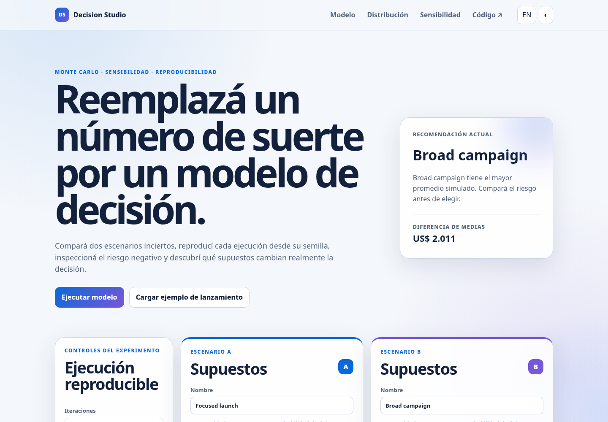
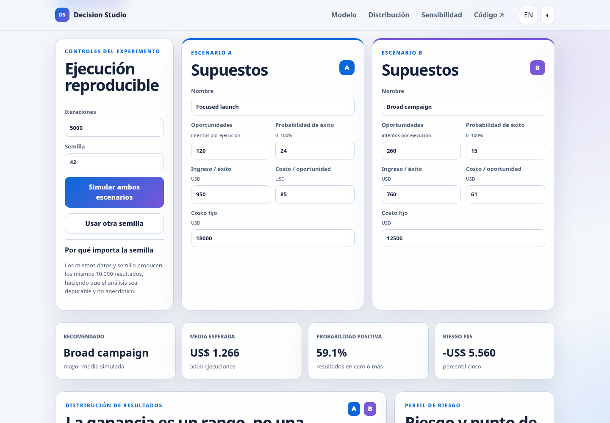
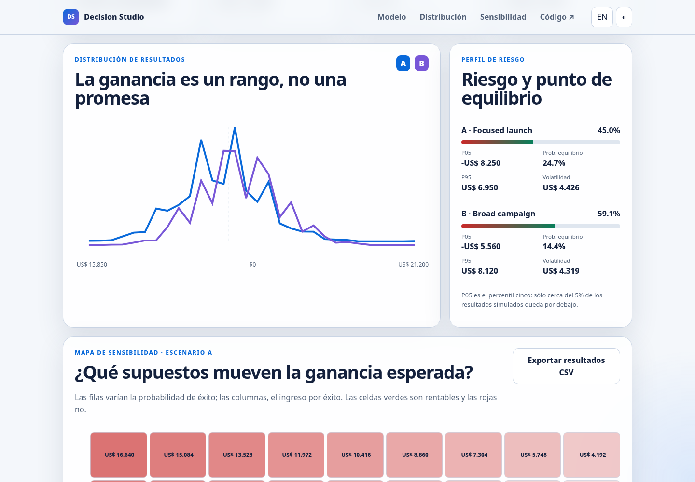
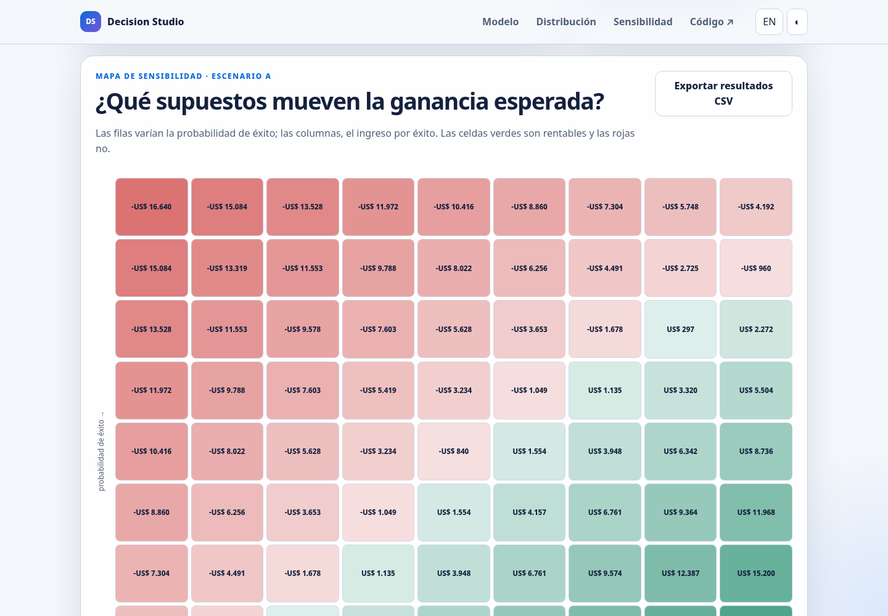
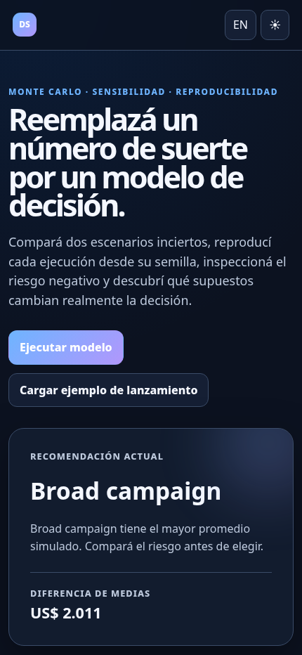

# Application screenshots

Screenshots of the original HTML/CSS/JavaScript application served locally from this repository. These projects are web applications, not substitute demos.

Captured on 2026-09-06. Existing preview assets are preserved.

## Overview

Original simulation application, computed comparison.

## Scenario Inputs

Editable assumptions for two scenarios.

## Distribution Risk

Calculated profit distributions and downside comparison.

## Sensitivity

Sensitivity heatmap from the real simulation engine.

## Mobile Dark

Simulation application in dark theme at mobile size.

